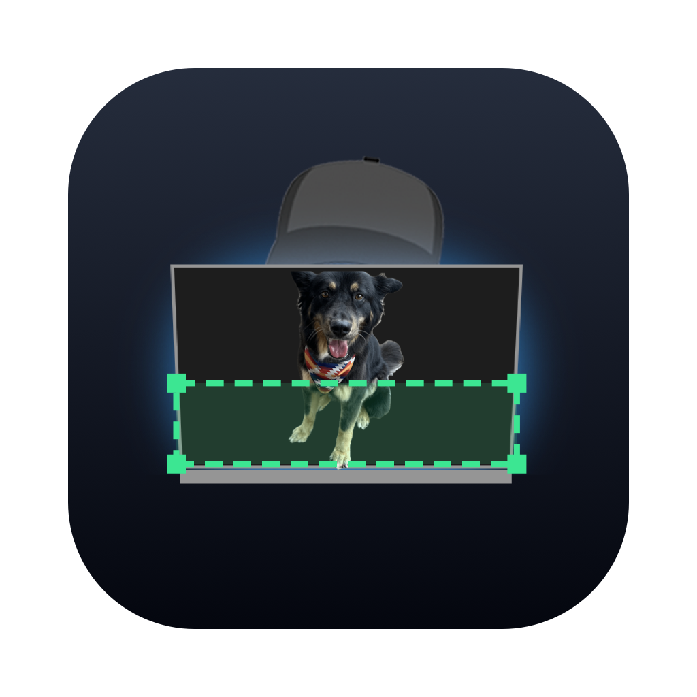
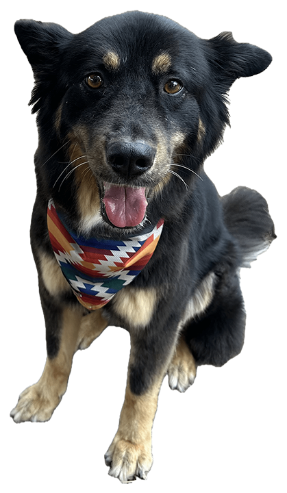

<p align="center">
  
</p>

# Capture NDI Region

Sends a cropped, scaled region of a macOS window as an NDI source.

**Capture NDI Region.app** runs multiple simultaneous feeds; **ndi-region** is
the CLI for scripting or launchd. Both use ScreenCaptureKit and load the NDI
runtime at launch via `dlopen`, so building requires Swift/Xcode but not the
NDI SDK.

## Download

Universal builds are on
[Releases](https://github.com/christhoms/capture-ndi-region/releases):
`Capture-NDI-Region-<version>.zip` (app) and `ndi-region-cli-<version>.zip`
(CLI). An NDI runtime is also required; see [NDI runtime](#ndi-runtime).

## Build from source

```sh
swift build -c release          # CLI at .build/release/ndi-region
Scripts/make-app.sh             # ad-hoc-signed app at "dist/Capture NDI Region.app"
Scripts/make-release.sh 1.2.3   # signed + notarized release zips (needs a
                                # Developer ID cert and notarytool credentials)
```

## App

Each feed row sets the NDI name, the window (exact pick, or **Auto** with
app/title match text: case-insensitive substring or `*`/`?` glob), the crop
(**Bottom strip** height or **Custom rect** x/y/w/h, in window points, origin
top-left), max output width, FPS, and Auto-start. **+** adds more feeds.

- Feeds persist in `~/Library/Application Support/CaptureNDIRegion/feeds.json`.
  Auto-start feeds begin streaming on launch.
- The Presets toolbar menu saves and loads feed configurations
  (`presets.json`). One preset ships built in.
- If the captured window goes away, the NDI source stays on air showing a
  slate image and reattaches when a matching window appears, typically within
  ~2s. Starting a feed before its window exists works the same way.
  Options > **Choose Slate Image...** replaces the built-in slate.
- Close collapses the window to a slim titlebar strip instead of quitting;
  Cmd-W or Cmd-Q quits. `CNR_START_COLLAPSED=1` starts collapsed, for launchd.
- The app needs Screen Recording permission and prompts on first launch. After
  a denial, a banner can reset the TCC entry and re-prompt (macOS never
  re-prompts on its own) and relaunch once granted.

## CLI

```sh
ndi-region --list                # list capturable windows
ndi-region --app ShowKontrol --bottom 220 --max-width 1920 --name "SK Decks Only"
ndi-region --window-id 1431 --bottom 400
```

| Flag | Default | Meaning |
|---|---|---|
| `--app <name>` | - | Match window by app name (case-insensitive substring) |
| `--title <substr>` | - | Additionally match by window title |
| `--window-id <id>` | - | Capture an exact window id from `--list` |
| `--bottom <pt>` | 400 | Height of the bottom strip, in window points |
| `--rect <x,y,w,h>` | - | Crop rect in window points, origin top-left (overrides `--bottom`) |
| `--max-width <px>` | 1920 | Output width cap; height follows aspect ratio |
| `--fps <n>` | 30 | Frame rate cap |
| `--name <s>` | `Region - <app>` | NDI source name |
| `--cursor` | off | Include the mouse cursor |
| `--dump-frame <path>` | - | Write the first captured frame to a PNG |

The window is tracked by id, so streaming continues when it is moved,
occluded, or resized. Ctrl-C stops cleanly.

## NDI runtime

The NDI library is not bundled (NDI's license does not allow redistribution).
It is searched for at launch, in order:

1. `$NDI_RUNTIME_DIR_V6` / `$NDI_RUNTIME_DIR_V5`
2. `/usr/local/lib/libndi.dylib`, where the
   [NDI runtime installer](https://ndi.link/NDIRedistV6Apple) and NDI Tools
   put it
3. The NDI SDK install (`/Library/NDI SDK for Apple`)
4. Runtimes bundled inside common NDI apps (Resolume, NDI Video Monitor)

If none is found, the app shows a banner with a download link; no relaunch is
needed after installing. For the CLI, install the runtime or set
`NDI_RUNTIME_DIR_V5` to a folder containing `libndi.dylib`.

## Notes

- The crop is captured at native (Retina) pixel density, then scaled. Output
  dimensions are rounded to even numbers for encoder compatibility.
- The terminal running the CLI needs Screen Recording permission
  (System Settings > Privacy & Security > Screen Recording).
- Frames are delivered only when window content changes (ScreenCaptureKit
  behaviour); NDI receivers hold the last frame.

---

<p align="center">
  <br>
  <sub>Quality assurance by the studio dawg.</sub>
</p>
